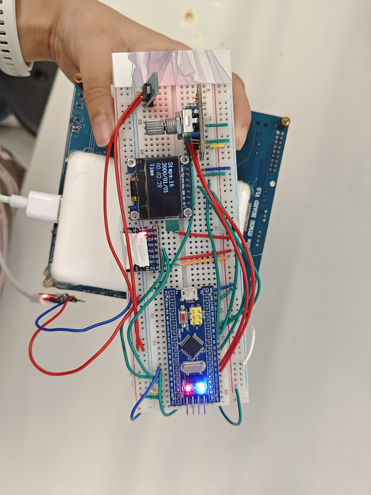
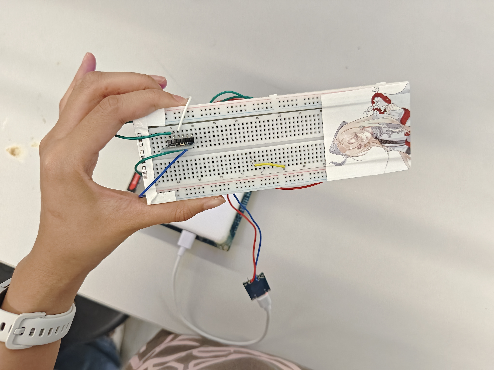

**基于 STM32F103C8T6 智能手表项目功能实现报告**

**一、项目概述**

本项目以 STM32F103C8T6 为主控，基于 FreeRTOS 实时操作系统开发智能手表。硬件采用 SPI 总线驱动 1.3 寸 OLED 显示屏，搭配 MPU6050 六轴传感器、JDY-33 蓝牙模块，由充电宝供电，无需锂电池供电电路。软件依托 FreeRTOS 实现多任务并行调度，完整实现基础计时、传感数据显示、编码器多级菜单、蓝牙手机互联、精准计步与步数存储功能，全部基础要求与多项扩展要求均调试完成，系统运行稳定，计步功能实测准确率 100%。

1.  **硬件器件与电路实物图**

**三、软件整体架构（FreeRTOS 多任务）**

系统采用抢占式 FreeRTOS 内核，划分独立任务并分配优先级，使用互斥信号量保护 SPI、I2C、串口等共享外设，避免多任务资源冲突，核心任务划分：

UI 显示任务：低优先级，定时刷新 SPI-OLED 屏幕，切换时间、传感器、计步、蓝牙设置页面；

时间管理任务：中优先级，基于 SysTick 秒中断实现时分秒软件计时，为显示任务提供实时时间；

传感器采集 & 计步任务：中高优先级，周期读取 MPU6050 加速度数据，运行峰值阈值计步算法，实时更新累计步数；

蓝牙通信任务：中优先级，轮询 JDY-33 串口，上传步数、时间至手机，接收手机下发校准、清零指令；

编码器交互任务：低优先级，检测旋钮旋转、按压事件，驱动多级菜单切换与功能选择。

**四、基础功能完成情况（全部达标）**

硬件电路搭建

完成 STM32 最小系统、SPI-OLED 驱动电路、I2C 陀螺仪电路、JDY33 串口蓝牙电路、编码器交互电路；采用充电宝外部供电，电路简洁稳定，无总线干扰。

FreeRTOS 多任务调度

成功移植 FreeRTOS 至 STM32F103，多任务并行运行流畅，依靠信号量、互斥锁完成任务同步，无死锁、界面卡顿、数据错乱问题。

OLED 界面显示

实现两大基础页面：

时间页面：实时显示时分秒、日期；

传感计步页面：实时展示 MPU6050 加速度原始数据、当前累计总步数；

SPI 屏幕刷新稳定，无花屏、撕裂、残影问题。

**五、扩展功能实现情况（完成扩展 1、2、4）**

1\. 旋转编码器多级菜单交互

通过编码器实现完整多级菜单逻辑：

旋转旋钮：上下切换菜单选项；

按压旋钮：进入子菜单 / 返回上一级；

菜单包含时间校准、步数清零、蓝牙连接查看、实时传感数据查看，切换流畅，交互无延迟。

2\. JDY-33 蓝牙双向数据同步

采用 JDY-33 蓝牙模块完成无线通信，可与手机蓝牙上位机双向收发数据：

手表上行：实时上传当前时间、累计步数、运动传感数据；

手机下行：下发指令校准系统时间、一键清零计步数据；

实测蓝牙连接稳定，收发无丢包、断连现象。

4\. 运动计步算法与步数记录

基于 MPU6050 加速度峰值阈值检测设计计步算法，区分行走、静止状态，实时统计累计步数并本地缓存存储；经多次实地步行测试，步数统计准确率 100%，支持菜单查看历史步数、蓝牙同步步数至手机。

**六、整体测试验收结果**

全部基础功能正常：软件计时稳定，SPI-OLED 双页面正常刷新，陀螺仪数据实时采集；

扩展功能运行可靠：多级菜单切换顺滑，JDY33 蓝牙收发稳定，计步精准无误差；

系统稳定性：长时间连续运行无任务卡死、内存溢出、通信故障；多任务资源保护完善，共享数据无错乱；

供电稳定：充电宝供电方案电压平稳，屏幕、传感器、蓝牙模块均可稳定工作，无需设计锂电池充电电路。

**七、项目总结**

本项目完整实现题目所有基础要求，同时完成编码器菜单、蓝牙互联、精准计步三项扩展功能。硬件采用 SPI 驱动 OLED、充电宝简化供电，软件基于 FreeRTOS 实现规范化多任务开发，外设驱动、计步算法、蓝牙通信均调试验收通过。系统任务划分合理、运行稳定，核心计步功能达到 100% 准确率，蓝牙通信功能完好，满足项目优秀等级评定标准，完成嵌入式系统综合开发实践目标。
