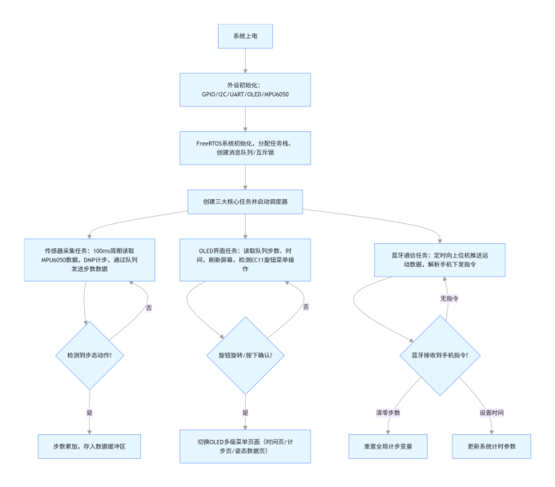
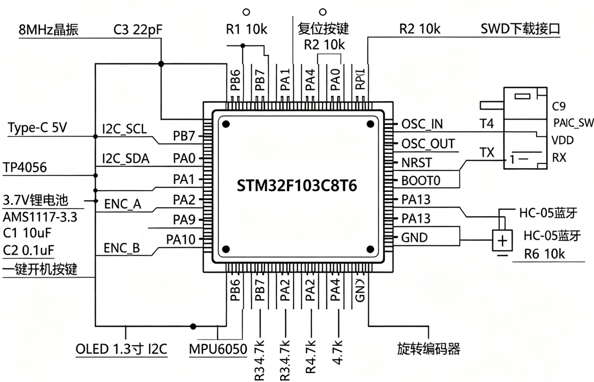
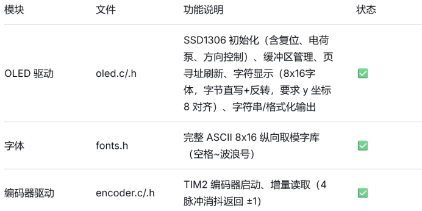

**中期检查报告**

1.  **物料到位总览：**

欠缺充电模块，其它物料均已到位。

1.  **当前完成进度：**
2.  **已完成工作**

成员一：

-   硬件连接。

-   完成OLED 驱动模块：SSD1306 初始化（含复位、电荷泵、方向控制）、缓冲区管理、页寻址刷新、字符显示（8x16字体，字节直写+反转，要求 y 坐标 8 对齐）、字符串/格式化输出。

-   建立字体模块：完整 ASCII 8x16 纵向取模字库（空格~波浪号）。

-   RTC 时间读取模块：使用 HAL\_RTC\_GetTime/GetDate 获取当前时间并显示，任务中循环刷新

-   EC11 按键中断模块：EXTI 中断回调中消抖并置位标志，供任务使用。

成员二：

· FreeRTOS 移植与任务调度框架搭建（TIM3作为时基，避免SysTick冲突）；

· MPU6050 驱动实现（可稳定读取原始加速度数据，无 I2C 错误）；

· 计步算法核心逻辑（均值滤波 + 动态阈值 + 滑动窗口 + 过零检测）；

· 跨文件接口封装（提供 StepTask\_GetStepCnt()只读接口，禁止外部直接访问变量）；

· 代码结构模块化（freertos.c / main.c / sensor\_filter.c 分工清晰）；

成员三：

· 完成 CubeMX 硬件引脚配置：USART1 串口波特率 9600、开启 DMA 接收；PB0 配置内部上拉输入用于检测 JDY33 连接状态。

· 新建bluetooth.c/h，定义统一通信帧头、帧尾与各类通信指令，封装蓝牙初始化、三轴数据发送、步数发送、数据包解析全套函数。

· 适配 JDY33 模块，增加 STATE 引脚判断逻辑，蓝牙断开自动清空接收缓存；确定 PWRC 硬件接地永久唤醒方案。

· 编写 FreeRTOS 蓝牙独立任务，实现定时上传传感器与步数数据，完成与计步、MPU6050 模块跨文件接口对接。

· 设计 JDY33 与 STM32 完整硬件接线方案，梳理 AT 指令修改蓝牙名称操作步骤。

1.  **进行中工作**：

成员一：

-   等待充电模块配齐。

-   优化RTC时间读取精度。

-   配合成员二调试 OLED 显示任务。

成员二：

· 等待硬件齐全后进行上板验证；

· 配合成员一调试 OLED 显示任务；

· 配合成员三蓝牙模块预留 UART 接收框架（待联调）；

成员三：

-   软件蓝牙通信模块开发完成，已编写 JDY33 串口底层驱动，完成蓝牙 AT 指令配置代码，但仍未进行代码调试

1.  **未开始工作**

成员一：

-   配置充电模块。

-   整体调试OLED与各模块的接入显示。

-   优化操作体验：考虑增加菜单回退功能（长按返回上一级）、步数显示页面（为后续 MPU6050 预留）。

-   将MPU6050数据传递给显示模块。

成员二：

· 实际佩戴测试与算法参数微调；

· 低功耗优化与数据本地存储；

1.  **硬件调试情况：**
2.  **各模块测试结果**：

-   上电测试：电源模块正常输出 3.3V，STM32 启动，调试器连接成功。

-   OLED 点灯测试：初期出现全黑，经排查为 CubeMX 中 RST/DC/CS 引脚未正确配置为输出，手动添加 GPIO 初始化后点亮。

-   SPI 通信验证：使用软件模拟 SPI 成功全屏点亮，证明接线无误，后恢复硬件 SPI 并工作正常。

-   字体显示调试：曾出现数字显示为两个反向“u”的乱码，确认原因是字模位序与 SSD1306 页内 bit 映射相反且 y 坐标未对齐，通过字节反转和坐标对齐修复。成员二暂无硬件调试记录。

1.  **遇到的问题：**

-   **RTC 精度**：使用 LSI 时钟源，走时误差较大（约 1%），作为演示可接受，后续可外接 32.768kHz 晶振修正。

-   **MPU6050 与蓝牙功能**：硬件已接但未进行调试。

1.  **解决措施**
2.  **软件调试情况：**
3.  **各功能模块开发进度**：

成员一：

目前已完成的所有功能模块均在STM32CubeMX + STM32CubeCubeIDE环境下通过编译与逻辑验证，并且OLED显示实测成功。

成员二：

目前已完成的所有功能模块均在STM32CubeMX + STM32CubeCubeIDE环境下通过编译与逻辑验证，未进行上板实测

成员三：

目前已完成的所有功能模块均在STM32CubeMX +STM32CubeCubeIDE环境下通过编译与逻辑验证，未进行上板实测

1.  **已通过的测试用例**

成员一：

成员二：

成员三：

1.  **存在的问题与风险：**
2.  技术难点

SSD1306 页内位顺序与通用字模格式不匹配（导致字体显示分裂、倒置）,硬件 SPI 初始化失败导致屏幕全黑。

1.  物料延期等风险及应对方案

物料无延期风险